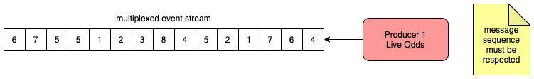
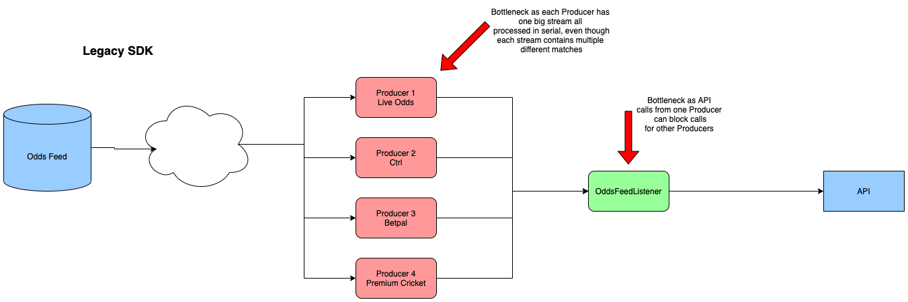
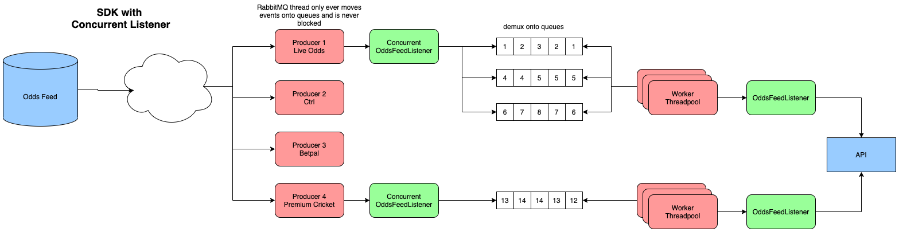
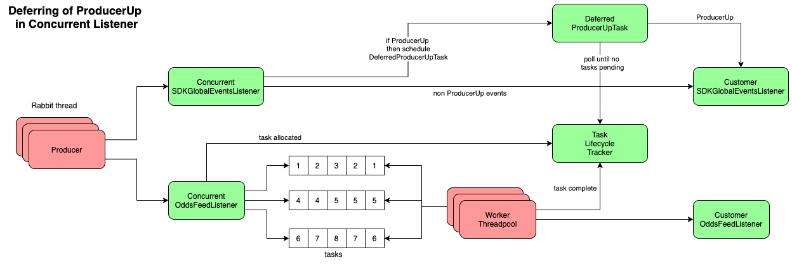
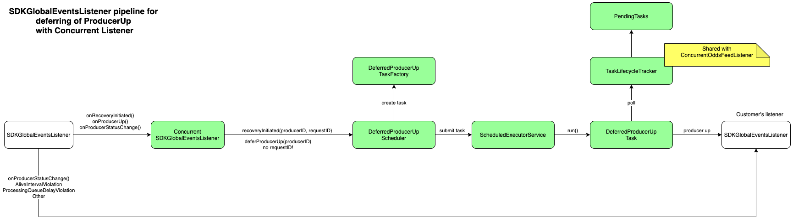

# Concurrent Listener implementation

----
## Legacy SDK issue

The legacy SDK has multiple Producers, each processing streams of event data. Each Producer
is very careful to process all events in sequence as follows:

The issue with this is that it causes bottlenecks. Producers are operating in parallel, but 
all events are processed in serial. A Producer handles events for multiple different matches,
but all that really matters is that the events for **each match** are processed in strict sequence.

It makes little sense that an event from Match A would come in, and block subsequent events
from Match B for the same Producer.

The SDK seems to have multiple Producers all sharing one processing pipeline, with a huge
number of locks used to prevent each Producer stepping on the toes of others. It would be 
far better and more efficient to have each Producer isolated by giving each Producer it's 
own processing pipeline. You could have shared pools of XML Marhshallers/Unmarshallers, 
HTTP clients etc.

By the time each event gets to the customers `OddsFeedListener`, we are still using the RabbitMQ
thread! This is very dangerous as it can hold up the consumption of messages, and if API calls
made by the customer block for long enough, the SDK may think that RabbitMQ is misbehaving and
can trigger recovery. The RabbitMQ thread should only ever read messages from RabbitMQ, and hand
each message off to another thread/queue for processing.

----
## Solution
What was needed was the following:
- prevent the RabbitMQ thread from processing events, so it can focus on just reading events
- process events in **match sequence**, and not in strict sequence of all events in the stream
- increase throughput of events by processing in parallel
- reduce the risk of one Producers API calls from affecting other Producers
- reduce the risk of customer `OddsFeedListener` processing from affecting other Producers
- isolate the customers `OddsFeedListener` to minimise blocking

----
## Implementation

The customer registers two types of listener when using the SDK:
- `OddsFeedListener` - handles all sport events
- `SDKGlobalEventsListener` - handles all global events (Producer up/down etc.)

The Concurrent Listener solution creates a space between the customers implementation of
`OddsFeedListener` and `SDKGlobalEventsListener` where we can process events in parallel
in a more efficient manner. It also means that the load is spread, and Producers are more
isolated from one another. If a Producer goes down, it only affects events belonging to
Producers on that particular queue.

Multiple `OddsFeedListeners` can be registered for each type of message interest. There is only 
ever one `SDKGlobalEventsListener` registered.

Since each Producer delegates events to an `OddsFeedListener`, we wrapped the customer
`OddsFeedListener` with a `ConcurrentOddsFeedListener`.
Likewise, we wrapped the customer `SDKGlobalEventsListener` with a `ConcurrentSDKGlobalEventsListener`.

Below is the solution using a `ConcurrentOddsFeedListener`:

The `ConcurrentOddsFeedListener` wraps each event in a `Runnable` task and these tasks are placed 
onto queues for processing. An `ExecutorService` using a pool of worker threads processes these 
task queues in parallel. When each task executes, the customer `OddsFeedListener` is invoked.

What is happening here is that we are demultiplexing (demux for short) the Producers events. We
assign an event to a queue using a hash of the event ID. This guarantees that all events for a 
specific match always end up on the same queue, and this satisfies the requirement that all 
events **per match** are processed in strict sequence.

### Deferring of ProducerUp

When a Producer goes down, events are lost and a strict sequence of events has to happen in order
for the Producer to be "up" :
- RabbitMQ recovery must be initiated
- A call is made to the Sports API `/recovery/initiate_request` endpoint
- A call is made to the Unified Odds Feed to resend all missing messages
- The `SDKGlobalEventsListener` is notified of _ProducerUp_ when all missed events have been 
processed by the customer `OddsFeedListener`

A recovery is initiated with a specified Request ID. This Request ID is very important and is 
used for tracking recovery progress for that specific Producer. The Request ID, together with
the Producer ID comprises a `RecoveryContext` which contains both of these values.

In the legacy SDK this all happens quite naturally since events are always processed in serial 
and synchronously (i.e. no concurrency). So when the last event arrives it is processed and the
`SDKGlobalEventsListener` is notified of _ProducerUp_.

_ProducerUp_ does not mean that the Producer is alive or reconnected to RabbitMQ, it actually
means that the Producer is "up to date" with all the missed event messages since it went down.

The issue with the Concurrent Listener, is that when the Unified Odds Feed sends the last missed
event, we can't notify the `SDKGlobalEventsListener` of _ProducerUp_ as most likely there would still
be events tasks on the queues and/or being processed by worker threads.

Therefore, we must defer the _ProducerUp_ until **all** tasks for that `RecoveryContext` have completed.

The Concurrent Listener solution has a `TaskLifecycleTracker` class which tracks the lifecycle of
all queued event tasks. Tasks are tracked based on a `RecoveryContext`.

`TaskLifecycleTracker` tracks the following for each event task:
- task allocated to queue
- task started (executed by worker thread)
- task completed (processed by customer `OddsFeedListener`)

The Producer Down/Up is managed by the SDKs recovery mechanism (see `RecoveryManagerImpl`). From
a customer point of view, they get notified of this via their `SDKGlobalEventsListener` implementation,
specifically these methods:
- `onRecoveryInitiated()` - invoked when a recovery is initiated and contains the Request ID
- `onProducerUp()` - invoked when Producer is Up (deprecated)
- `onProducerStatusChange()` - invoked when Producer status changes

The `onProducerStatusChange()` method is considered to be a _ProducerUp_ when the status parameter is 
one of the following:
- `FirstRecoveryCompleted`
- `ProcessingQueDelayStabilized`
- `ReturnedFromInactivity`

So all event tasks are fully tracked by `TaskLifecycleTracker`. These event tasks are created
based on invocations to the `ConcurrentOddsFeedListener`. The other half of the solution is taken
care of in `ConcurrentSDKGlobalEventsListener`:

When `ConcurrentSDKGlobalEventsListener` is notified of `onRecoveryInitiated()`, we store that
specific `RecoveryContext` so we can correlate the 
corresponding _ProducerUp_ via `onProducerUp()` or `onProducerStatusChange()` when it happens.

When `ConcurrentSDKGlobalEventsListener` is notified of `onProducerUp()` or `onProducerStatusChange()`
(with the correct status), then we schedule a `DeferredProducerUpTask` which polls the status
of the pending tasks for that specific `RecoveryContext`. When the count of the pending tasks for 
that `RecoveryContext` reaches zero, then we propagate the _ProducerUp_ to the customers
`SDKGlobalEventsListener`.

There are plenty of unit tests for the classes in the Concurrent Listener solution, but the
most important are the component tests in `DeferredProducerUpComponentTest` which
use multiple threads to verify all scenarios behave as expected.

----
## Configuration

The following are used to configure the Concurrent Listener solution:

- `enabled` - enables use of Concurrent Listener solution
- `threads` - the number of worker threads in a pool for each registered customer `OddsFeedListener`
- `queueSize` - the size of each task queue
- `handleErrorsAsynchronously` - whether error events are handled on the RabbitMQ thread, or 
if they should be spread randomly over the task queues and handled asynchronously

See `ConcurrentListenerConfig` class for these fields.

The `threads` configuration value should ideally be a multiple of 10. In `TaskAllocator` you can see how
each task is allocated to a queue based on a hash of it's Task ID. Task ID is a simple wrapper 
around the incoming events Event ID.

----
## Improvements

For now, each `ConcurrentOddsFeedListener` has its own pool of worker threads, but we could
also have one bigger shared pool of threads for all registered listeners.
